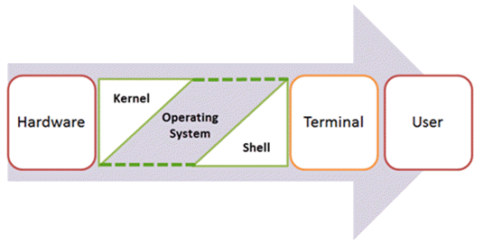
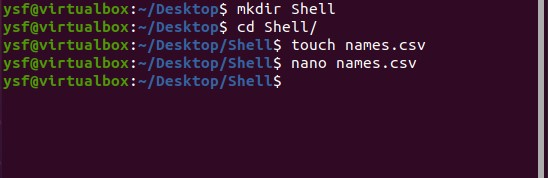
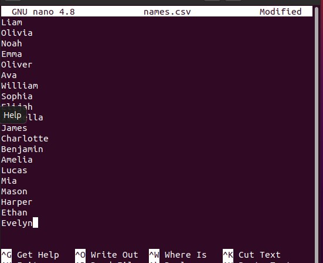
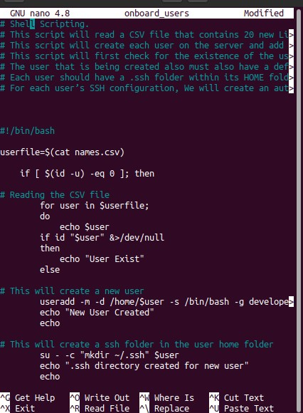
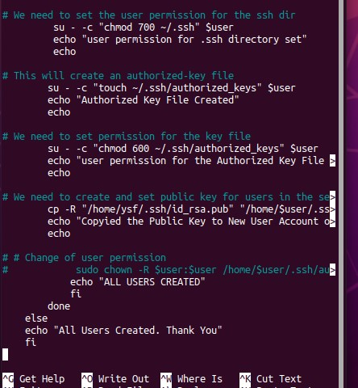
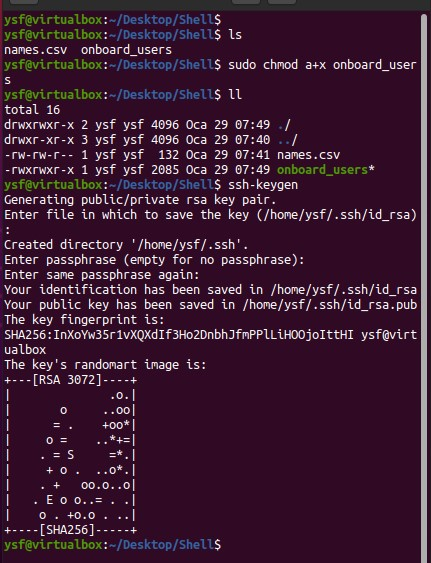
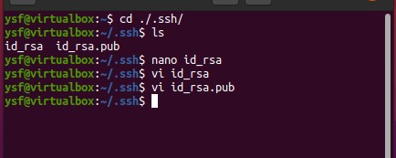
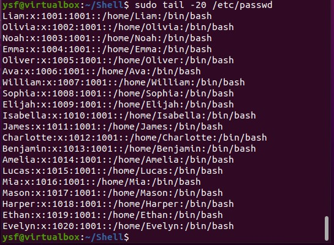
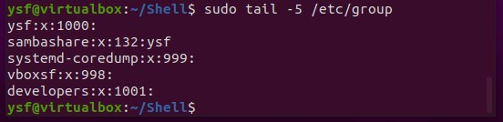
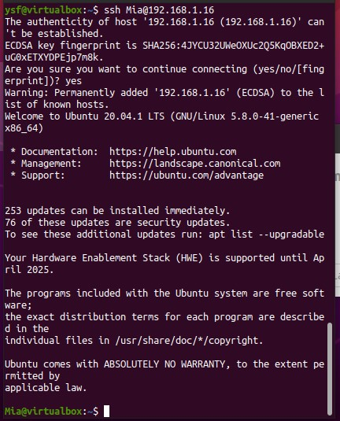

# What is Shell?
## Shell is a UNIX term for an interface between a user and an operating system service. Shell provides users with an interface and accepts human-readable commands into the system and executes those commands which can run automatically and give the program’s output in a shell script.

## An Operating is made of many components, but its two prime components are -

* Kernel
* Shell



# Components of Shell Program
## A Kernel is at the nucleus of a computer. It makes the communication between the hardware and software possible. While the Kernel is the innermost part of an operating system, a shell is the outermost one.

## A shell in a Linux operating system takes input from you in the form of commands, processes it, and then gives an output. It is the interface through which a user works on the programs, commands, and scripts. A shell is accessed by a terminal which runs it. When you run the terminal, the Shell issues a command prompt (usually $), where you can type your input, which is then executed when you hit the Enter key. The output or the result is thereafter displayed on the terminal. The Shell wraps around the delicate interior of an Operating system protecting it from accidental damage. Hence the name Shell.

# Components of Shell Program
## A Kernel is at the nucleus of a computer. It makes the communication between the hardware and software possible. While the Kernel is the innermost part of an operating system, a shell is the outermost one.

## A shell in a Linux operating system takes input from you in the form of commands, processes it, and then gives an output. It is the interface through which a user works on the programs, commands, and scripts. A shell is accessed by a terminal which runs it. When you run the terminal, the Shell issues a command prompt (usually $), where you can type your input, which is then executed when you hit the Enter key. The output or the result is thereafter displayed on the terminal.

## The Shell wraps around the delicate interior of an Operating system protecting it from accidental damage. Hence the name Shell.

# How to Write Shell Script in Linux/Unix
## Shell Scripts are written using text editors. On your Linux system, open a text editor program, open a new file to begin typing a shell script or shell programming, then give the shell permission to execute your shell script and put your script at the location from where the shell can find it.

# Let us understand the steps in creating a Bash Script:

* Create a file using a vi editor(or any other editor).  Name  script file
* Start the script with #! /bin/bash
* Write some code.
* Save the script file as filename
* For executing the script type bash filename

## "#!" is an operator called shebang which directs the script to the interpreter location. So, if we use"#! /bin/bash" the script gets directed to the bourne-shell.

<p>

## In this project, we need to onboard 20 new Linux users onto a server. We will create a shell script that reads a csv file that contains the first name of the users to be onboarded.

### 1. Create the project folder called Shell

```
$ mkdir Shell
```

### 2. Move into the Shell folder

```
$ cd Shell
```

### 3. Create a csv file name names.csv
```
$ touch names.csv
```

### 4. Open the names.csv file
```
$ nano names.csv
```

We should see output like this below,



### 5. Insert some random names into it. (One name per line)

```
Liam
Olivia
Noah
Emma
Oliver
Ava
William
Sophia
Elijah
Isabella
James
Charlotte
Benjamin
Amelia
Lucas
Mia
Mason
Harper
Ethan
Evelyn
```
We should see output like this below,




## The following script will onboard our 20 Linux Users onto our Server.

```bash
# Shell Scripting.
# This script will read a CSV file that contains 20 new Linux users.
# This script will create each user on the server and add to an existing group called 'Developers'.
# This script will first check for the existence of the user on the system, before it will attempt to create that it.
# The user that is being created also must also have a default home folder
# Each user should have a .ssh folder within its HOME folder. If it does not exist, then it will be created.
# For each user’s SSH configuration, We will create an authorized_keys file and add the below public key.

#!/bin/bash

userfile=$(cat names.csv)

    if [ $(id -u) -eq 0 ]; then

# Reading the CSV file
	for user in $userfile;
	do
            echo $user
        if id "$user" &>/dev/null
        then
            echo "User Exist"
        else

# This will create a new user
        useradd -m -d /home/$user -s /bin/bash -g developers $user
        echo "New User Created"
        echo

# This will create a ssh folder in the user home folder
        su - -c "mkdir ~/.ssh" $user
        echo ".ssh directory created for new user"
        echo

# We need to set the user permission for the ssh dir
         su - -c "chmod 700 ~/.ssh" $user
         echo "user permission for .ssh directory set"
         echo

# This will create an authorized-key file
        su - -c "touch ~/.ssh/authorized_keys" $user
        echo "Authorized Key File Created"
        echo

# We need to set permission for the key file
        su - -c "chmod 600 ~/.ssh/authorized_keys" $user
        echo "user permission for the Authorized Key File set"
        echo

# We need to create and set public key for users in the server
        cp -R "/home/ysf/.ssh/id_rsa.pub" "/home/$user/.ssh/authorized_keys"
        echo "Copyied the Public Key to New User Account on the server"
        echo
        echo

        echo "USER CREATED"
            fi
        done
    else
    echo "All Users Created. Thank You"
    fi
```

We should see output like this below,






















# CREDIT
## https://www.guru99.com/introduction-to-shell-scripting.html
## https://professional-pbl.darey.io/en/latest/aux-project-1.html